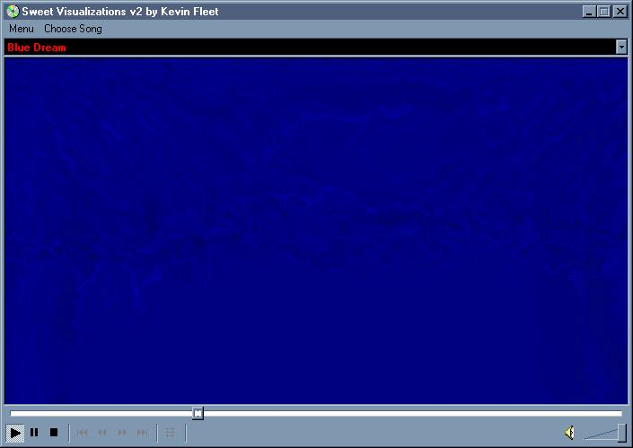



## Sweet Visualizations v2\.0

### Description

yet more visualizations from me... now you have some more basic visuals and plus some more advanced... the advanced are what i like to call "dreams" or just scopes that sort of swirl away (as seen above) they come in 7 colors and one type that switchs from color to color. anyways there is now more than 20 visuals in all so check it out and PLEASE VOTE AND PLEASE COMMENT!
 
### More Info
 

             |
---                |---
**Submitted On**   |2002-05-20 19:50:16
**By**             |[poop\_4\_brains](https://github.com/Planet-Source-Code/PSCIndex/blob/master/ByAuthor/poop-4-brains.md)
**Level**          |Intermediate
**User Rating**    |4.1 (33 globes from 8 users)
**Compatibility**  |VB 6\.0
**Category**       |[Graphics](https://github.com/Planet-Source-Code/PSCIndex/blob/master/ByCategory/graphics__1-46.md)
**World**          |[Visual Basic](https://github.com/Planet-Source-Code/PSCIndex/blob/master/ByWorld/visual-basic.md)
**Archive File**   |[Sweet\_Visu853735202002\.zip](https://github.com/Planet-Source-Code/poop-4-brains-sweet-visualizations-v2-0__1-34970/archive/master.zip)

